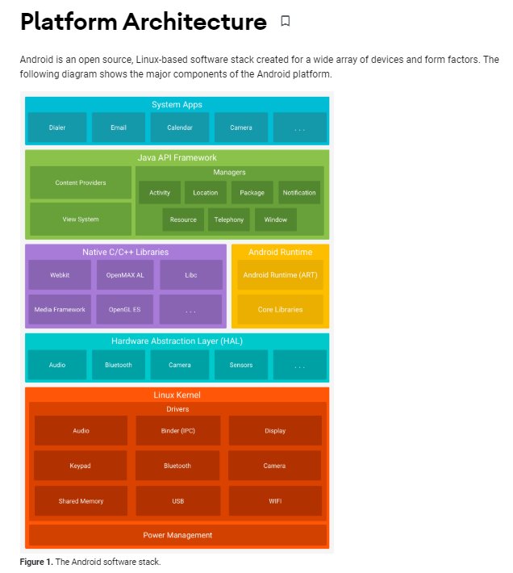
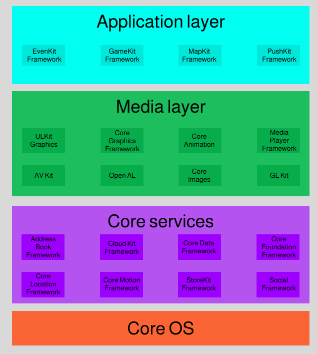

# Проект №9 — Мобильное тестирование.

Привет, участник Школы 21! В этом проекте мы поговорим о том, что необходимо знать для начала мобильного тестирования: о платформах, средствах для тестирования. Ты узнаешь, что такое эмуляторы, поработаешь с некоторыми из них и протестируешь приложение tutu. 

## Instructions

Напоминаем, что все отчёты по результатам выполнения заданий тебе нужно оформлять в файлах с расширением `.md`. Если они уже созданы, то пересоздавать или удалять их не нужно (просто отредактируй этот файл). Все созданные отчёты и файлы тебе нужно будет загрузить в папку `src/` в корне проекта (обязательно в ветку _develop_). 

## Contents

1. [Chapter I](#chapter-i) \
    1.1. [Общая инструкция](#общая-инструкция) 
2. [Chapter II](#chapter-ii) \
    2.1. [Мобильные платформы](#мобильные-платформы)  \
    2.2. [Задание №1](#типы-и-требования-мобильных-платформ)
3. [Chapter III](#chapter-iii) \
    3.1. [Типы мобильных приложений](#типы-мобильных-приложений)  \
    3.2. [Задание №2](#задание-2-этапы-тестирования)
4. [Chapter IV](#chapter-iv) \
    4.1. [Эмуляторы](#эмуляторы)  \
    4.2. [Задание №3](#задание-3-эмуляция-систем)
5. [Chapter V](#chapter-v) \
    5.1. [Задание №4](#задание-4-тест-кейсы) \
    5.2. [Задание №5](#задание-5-тестирование-мобильного-приложения)

<h2 id="chapter-i">Chapter I</h2> 

<h3 id="общая-инструкция">Общая инструкция</h3>

Методология Школы 21 может быть не похожа на тот образовательный опыт, который случался с тобой ранее. Её отличает высокий уровень автономии: у тебя есть задача, ты должен её выполнить. По большей части тебе нужно будет самому добывать знания для её решения. Второй важный момент — это peer-to-peer обучение. В образовательном процессе нет менторов и экспертов, перед которыми ты защищаешь свой результат. Ты это делаешь перед таким же учащимися, как и ты сам. У них есть чек-лист, который поможет им качественно выполнить приемку вашей работы.

Роль Школы 21 заключается в том, чтобы обеспечить через последовательность заданий и оптимальный уровень поддержки такую траекторию обучения, при которой ты не только освоишь hard skills, но и научишься самообучаться.

- Не доверяй слухам и предположениям о том, как должно быть оформлено ваше решение. Этот документ является единственным источником, к которому стоит обращаться по большинству вопросов;
- твое решение будет оцениваться другими учащимися;
- подлежат оцениванию только те файлы, которые ты выложил в GIT (ветка develop, папка src);
- в твоей папке не должно быть лишних файлов — только те, что были указаны в задании;
- не забывай, что у вас есть доступ к интернету и поисковым системам;
- обсуждение заданий можно вести и в Rocket.Chat;
- будь внимателен к примерам, указанным в этом документе — они могут иметь важные детали, которые не были оговорены другим способом;
- и да пребудет с тобой Сила!

<h2 id="chapter-ii" >Chapter II</h2>

<h3 id="мобильные-платформы">Мобильные платформы</h3>

Прежде чем мы перейдем к мобильному тестированию, давай разберемся с мобильными платформами.

Платформа, в том значении, которое нужно тестировщику, включает три составляющие:

- мобильная операционная система;
- тип устройства;
- тип мобильного приложения.

На официальных сайтах основных платформ есть много полезной информации для разработки и тестирования.

На картинках ниже представлены архитектуры двух основных ОС:

Android Platform Architecture.



iOS Platform Architecture.



<h3 id="типы-и-требования-мобильных-платформ" >Задание №1. Типы и требования мобильных платформ</h3>

- Создай файл `exercise1.md`, опиши в нём особенности тестирования мобильных приложений. 
- В файл `exercise1.md` внеси информацию о типах мобильных приложений. В чем различия тестирования каждого типа?

<h2 id="chapter-iii" >Chapter III</h2>

<h3 id="задание-2-этапы-тестирования" >Задание №2. Этапы тестирования</h3>

Вспомни этапы тестирования веб-приложений и подумай над тем, какие из этих этапов могут быть применимы к тестированию мобильных приложений. Подробно опиши их в файле `exercise2.md`.

<h2 id="chapter-iv" >Chapter IV</h2>

<h3 id="эмуляторы" >Эмуляторы</h3>

С тестированием приложений, разрабатываемых под несколько мобильных платформ, могут помочь программы, которые способны копировать функции другой вычислительной системы — **эмуляторы**.

Несмотря на то, что эмуляторы не способны абсолютно достоверно смоделировать устройство, они очень удобны, так как не всегда есть возможность провести тестирование на всех видах реальных мобильных устройств. Как правило, в компаниях используют лицензионные версии эмуляторов с расширенными функциональными возможностями. Есть и бесплатные версии, возможности которых ограничены, доступ к которым предоставляется на ограниченное время. Функции и доступность таких программ периодически меняется, поэтому в задании вам будет предложено несколько эмуляторов iOS, нужно будет выбрать один, наиболее подходящий и доступный на момент старта проекта.

<h3 id="задание-3-эмуляция-систем" >Задание №3. Эмуляция систем</h3>

- В рамках курса предложенным приложением для тестирования будет "tutu". Скачай и установи его себе на телефон. 
- Найди и запиши ключевые различия между веб- и нативным приложениями "tutu" в файл `exercise3.diff.md`.
- Для эмуляции тестирования iOS версий приложений установи и настрой одну из следующих программ: Air Phone Emulator, Ipadian, Appetize.io, Smartface.
- В большинстве бесплатных версий iOS эмуляторов нет возможности загрузить приложение. Поэтому, если ты не сможешь загрузить в эмулятор приложение, то найди любое понравившееся тебе доступное приложение в эмуляторе и потренируйся на нем.
- Сделай скрин работы с iOS приложением в эмуляторе, назови скрин `exercise3.1.png`.
- Установи Android Studio SDK, создай в нем проект, выбери одну версию телефона (любую, на которой ты хочешь провести тестирование).

_P.S.: возможно тебе придется установить аппаратную виртуализацию в BIOS на твоем ПК для запуска виртуального устройства. В интернете есть инструкции как это сделать._ 😉

- Изучи возможности "Your Virtual Device", который ты только что создал в Android Studio. Добавь описание возможностей в файл `exercise3.simulator.md`.

<h2 id="chapter-v" >Chapter V</h2>

Теперь можно приступить к тестированию нативного (скачанного из App Store или Google Play) и веб-приложения (https://www.tutu.ru/ в браузере мобильного телефона) приложения "tutu".

<h3 id="задание-4-тест-кейсы" >Задание №4. Тест-кейсы </h3>

Создай тестовый набор для тестирования мобильного приложения "tutu".  Функции приложения можно выбрать любые. В конечном итоге необходимо сформулировать не менее 35 тест-кейсов. Их необходимо добавить в TestIT и выгрузить в формате xlsx (файл назови `exercise4.xlsx`).

Написанные тобой тест-кейсы должны включать в себя проверки работоспособности определенной части приложения, а также проверки на прерывание различных операций, проверки на зависимость от сети и т.д.

<h3 id="задание-5-тестирование-мобильного-приложения" >Задание №5. Тестирование мобильного приложения</h3>

- Проведи тестирование в установленном приложении на твоем девайсе (iOS или Android). После выполнения всех 35 тест-кейсов сформируй отчет о тестировании с указанием типа и версии мобильного устройства, списком пройденных тестов и найденных дефектов (если есть). Назови файл с отчётом `exercise5.native.md`.
- Проведи то же тестирование в любом браузере на вашем девайсе (iOS или Android). После прохождения всех 35 тест-кейсов сформируй отчет о тестировании с указанием типа и версии мобильного устройства, списком пройденных тестов и найденных дефектов (если есть). Назови файл с отчётом `exercise5.web.md`.

<h3 id="double-check">Double-check</h3>

Перед загрузкой выполненного проекта в репозиторий перепроверь наличие всех необходимых файлов, которые требовалось создать во время его выполнения:

```
exercise1.md
exercise2.md
exercise3.diff.md
exercise3.simulator.md
exercise3.1.png
exercise4.xlsx
exercise5.native.md
exercise5.web.md
```
💡 [Нажми здесь](https://forms.gle/63fTQQaMcauTUSUp9) **чтобы отправить обратную связь по проекту**.
